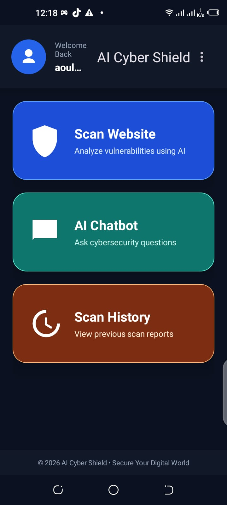
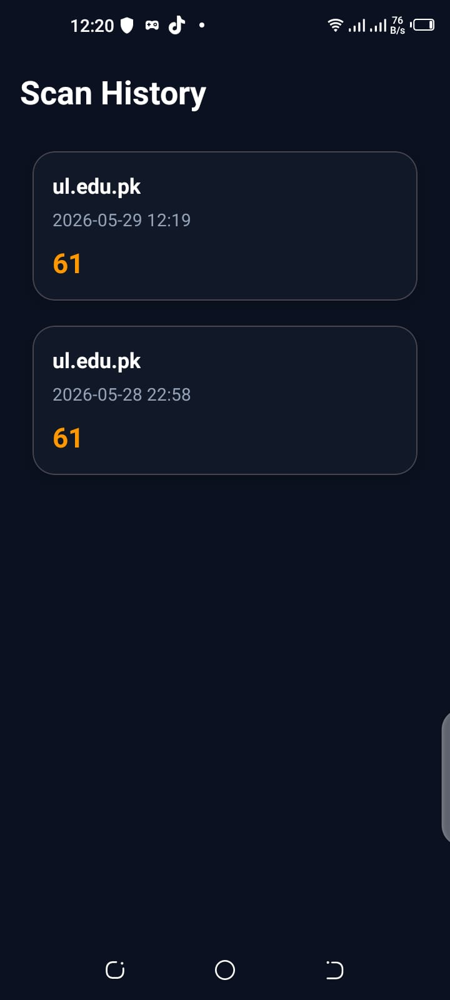
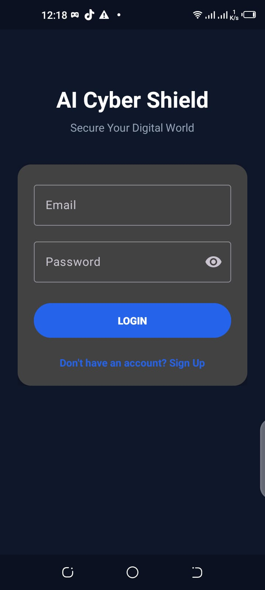
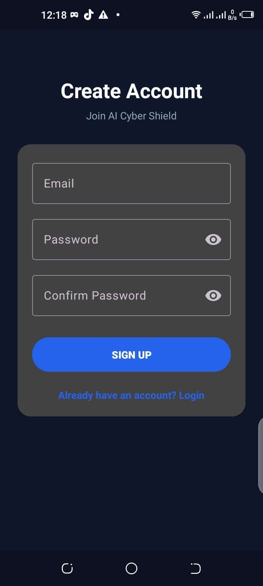
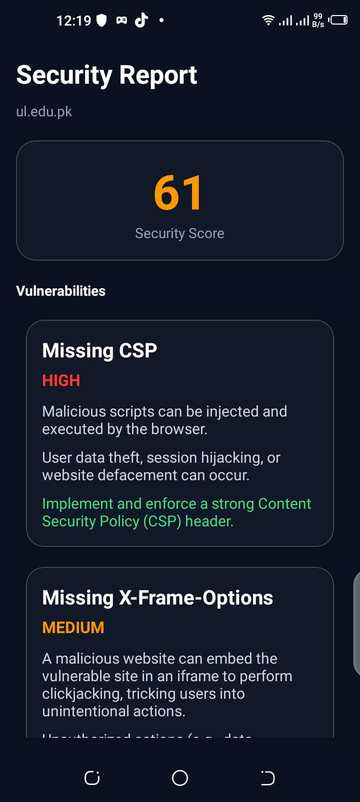
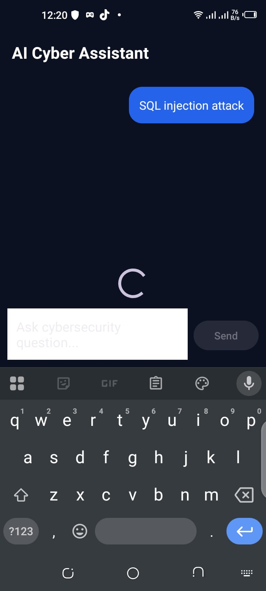
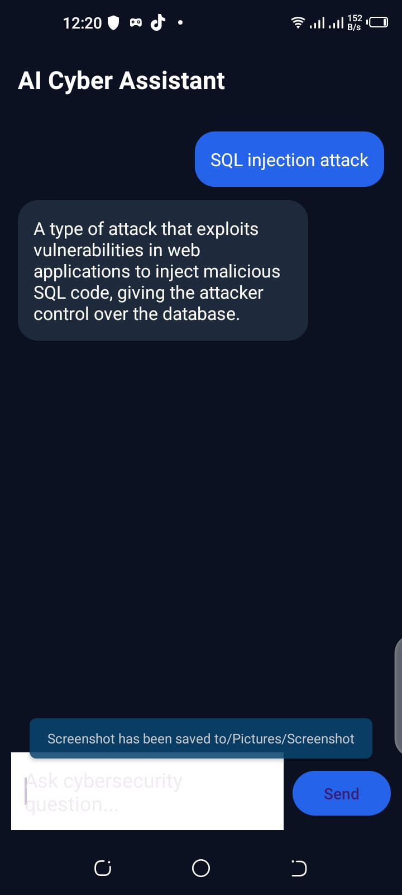
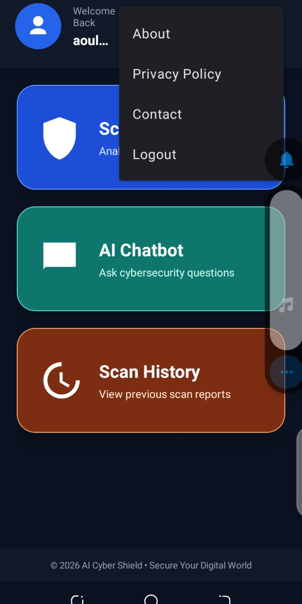

 🛡️ AI Cyber Shield – Android App

 📱 Overview
**AI Cyber Shield** is a powerful Android application that scans any website for security vulnerabilities. It checks for missing security headers, open ports, CMS detection, and performs active XSS and SQL injection tests. The app uses **Google Gemini AI** to generate simple, human‑readable explanations of each vulnerability (attack, impact, and fix), making cybersecurity accessible to everyone.  
User authentication is handled securely via **Firebase Authentication** (email/password).


 ✨ Features
User authentication: – sign up / login using Firebase
One‑tap website scan: – just enter a URL
Security headers detection: – CSP, HSTS, X‑Frame‑Options
Open ports scan: – 80, 443, 22, 3306
Active XSS & SQL injection testing: – real payloads sent to parameters
AI‑powered explanations: – attack, impact, fix (Gemini 2.0 Flash‑Lite / 2.5 Flash)
Built‑in cybersecurity chatbot: – ask anything about security
Security score (0–100): – instantly know your website’s risk level
Scan history** – saved reports (local database)
Multi‑key Gemini rotation: – no quota issues (uses 3 separate projects)
Fallback explanations: – common vulnerabilities answered instantly without API calls


## 🛠️ Technologies Used
| Category      | Technology                                |
|---------------|-------------------------------------------|
| Frontend      | Kotlin, Retrofit, OkHttp, Material Design |
| Authentication | Firebase Authentication (email/password)  |
| Backend       | Python FastAPI (hosted on Render)         |
| AI            | Google Gemini 2.0 Flash‑Lite / 2.5 Flash  |
| Database      | Room Database local                       |


The app communicates with a live backend API deployed at [https://ai-cyber-shield1.onrender.com]
backend code :
https://github.com/aoun234/ai-cyber-shield1

📌 Future Enhancements

- **Real database** – Save scan history and user reports using Firebase Firestore or Room database.
- **More vulnerability scans** – Add SSL/TLS certificate check, subdomain takeover, directory brute‑forcing.
- **More AI concepts** – Use Gemini to generate security tips, risk summaries, and automated fix suggestions.
- **Dark mode** – User‑friendly theme toggle.
- **PDF reports** – Export scan results as PDF for sharing.
- **Scheduled scans** – Automatically scan websites daily and notify users.

## 📸 Screenshots

| Dashboard                                  | Scan Dashboard                                      | Scan History                                    | Login                                  | Signup                                  |
|--------------------------------------------|-----------------------------------------------------|-------------------------------------------------|----------------------------------------|-----------------------------------------|
|    |    |    |    |   |

| Report                              | Chatbot                               | Cyber Chatbot                                     | Menu                            |
|-------------------------------------|---------------------------------------|---------------------------------------------------|---------------------------------|
|   |   |    |   |

 📥 Download APK
[📲 Download AI Cyber Shield APK](apk/AI-Cyber-Shield.apk)

> The APK is signed and ready to install on any Android device (Android 6.0+).

 📲 How to Install
1. Download the APK from the link above.
2. On your Android phone, open the downloaded `.apk` file.
3. If prompted, allow installation from unknown sources** (Settings → Security → Unknown sources).
4. Tap Install.
5. Once installed, open the app, create an account or log in**, and start scanning websites.

 🚀 How to Run the Project (for Developers)
1. Clone this repository:
   ```bash
   git clone https://github.com/aoun234/AI-Cyber-Shield-Android.git

 